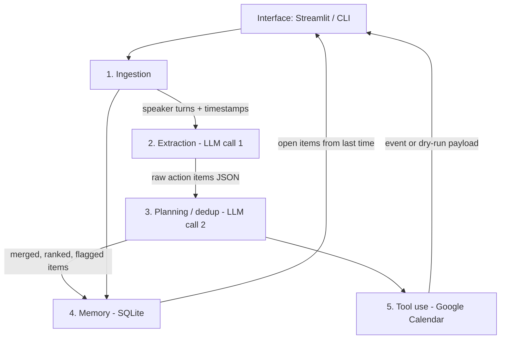

# MeetingPilot

## What this does

MeetingPilot is a small agent that reads a meeting transcript (pasted text, `.txt`, `.vtt`, or `.srt`) and turns it into tracked action items. It extracts structured tasks with owners, due dates, priorities, source quotes, and confidence scores, then stores them in a local SQLite database so later meetings can surface work that is still open. When a task has a due date, it can create a Google Calendar event — or print the exact API payload in `--dry-run` mode if Calendar is not set up.

## Architecture diagram

Six explicit layers. Data only moves downward; extraction and planning are **two separate LLM calls**.



```
transcript .txt/.vtt/.srt/paste
        |  Ingestion
        v
 speaker-turn segments
        |  Extraction (Anthropic tool call #1)
        v
 {task, owner, due_date_iso, priority, source_quote, confidence}
        |  local date resolution vs meeting date
        |  Planning (Anthropic tool call #2 + deterministic dedup)
        v
 merged / ranked items + missing owner/date flags
        |  Memory (meetings.db)
        v
 persist + "still open from last time"
        |  Calendar tool (or --dry-run payload)
        v
 Streamlit table grouped by owner
```

## Setup

1. Clone the repo and enter it:

   ```bash
   git clone <this-repo-url> MeetingPilot
   cd MeetingPilot
   ```

2. Install Python 3.11+ and [uv](https://docs.astral.sh/uv/). This project pins 3.11 in `.python-version`. If you only have 3.12+, `uv` will still install a 3.11 interpreter:

   ```bash
   uv python install 3.11
   uv sync --extra dev
   ```

   Prefer a venv instead of uv?

   ```bash
   python3.11 -m venv .venv
   source .venv/bin/activate
   pip install -e ".[dev]"
   ```

3. **LLM API key (required for extraction + planning).** MeetingPilot uses the Anthropic API with forced tool calling (structured JSON), not free-text parsing.

   - Create an API key at [https://console.anthropic.com/](https://console.anthropic.com/).
   - Copy the example env file and paste the key:

     ```bash
     cp .env.example .env
     ```

   - Set `ANTHROPIC_API_KEY=sk-ant-...` inside `.env`. Optionally override `ANTHROPIC_MODEL` (default `claude-sonnet-4-20250514`).

4. **Google Calendar OAuth (optional — skip if you will demo with `--dry-run`).**

   1. Open [Google Cloud Console](https://console.cloud.google.com/) and create (or select) a project.
   2. **APIs & Services → Library** → enable **Google Calendar API**.
   3. **APIs & Services → OAuth consent screen**:
      - User type: External (or Internal on a Workspace org).
      - App name: `MeetingPilot`.
      - Add your Google account as a test user if the app is in Testing.
   4. **APIs & Services → Credentials → Create credentials → OAuth client ID**.
      - Application type: **Desktop app**.
      - Download the JSON file.
   5. Save that file as `credentials.json` in the project root (it is gitignored). `credentials.example.json` shows the expected shape.
   6. Scope to enable / request (this is the only Calendar scope MeetingPilot uses):

      `https://www.googleapis.com/auth/calendar.events`

      That scope allows creating/updating events, not wiping the whole calendar.
   7. On the first **live** calendar push, a browser window opens. Sign in, accept the scope, and MeetingPilot writes `token.json` next to the project (also gitignored). Later runs reuse that token and refresh it when needed.

5. Confirm `.env` exists and `credentials.json` is present only if you plan to create real events.

## Running it

From the project root, with the virtualenv managed by uv:

**Web UI (fastest demo):**

```bash
uv run streamlit run app.py
```

In the sidebar, leave **Calendar dry-run** checked unless you completed Google OAuth. Load `samples/01_sprint_planning.txt`, set the meeting date to `2026-08-19`, click **Process Meeting**.

**CLI — extraction only (LLM call #1, JSON to stdout, no DB):**

```bash
uv run python -m meetingpilot \
  --transcript samples/01_sprint_planning.txt \
  --meeting-date 2026-08-19 \
  --extract-only
```

**CLI — full pipeline (ingest → extract → plan → SQLite), no live Calendar:**

```bash
uv run python -m meetingpilot \
  --transcript samples/01_sprint_planning.txt \
  --meeting-date 2026-08-19 \
  --title "Sprint planning" \
  --dry-run
```

**CLI — print Calendar payloads without calling Google (`--dry-run` is the default when pushing):**

```bash
uv run python -m meetingpilot \
  --transcript samples/01_sprint_planning.txt \
  --meeting-date 2026-08-19 \
  --push-calendar
```

**CLI — actually create Google Calendar events** (requires `credentials.json` + a one-time browser login):

```bash
uv run python -m meetingpilot \
  --transcript samples/01_sprint_planning.txt \
  --meeting-date 2026-08-19 \
  --push-calendar \
  --live-calendar
```

Paste mode: omit `--transcript` and pipe text on stdin.

Demo without Calendar credentials is the expected path: keep dry-run on. The UI still shows the exact `events.insert` JSON body.

## Running tests

No API keys and no Google account required. Mocks cover Calendar; schema/date/dedup/memory tests are local.

```bash
uv run pytest -q
```

Equivalent with venv: `pytest -q`.

## Design decisions & limitations

**Why extraction and planning are separate LLM calls.** Extraction is a *faithful read*: copy tasks, owners, quotes, and spoken dates from the transcript, even if they are messy or duplicated. Planning is an *editorial pass*: merge overlapping items, flag missing owners/dates, propose defaults, and rank. Folding both into one mega-prompt makes it hard to see (or test) which mistakes are “the model misheard the meeting” vs “the model over-normalized.” The rubric also wants a visible planning layer; a second forced tool call keeps that boundary demo-able.

After extraction, **relative dates are resolved in Python** against the meeting date (`by Friday`, `next week`). That logic is unit-tested and does not depend on the model.

**Low-confidence extractions.** Items with `confidence` below `LOW_CONFIDENCE_THRESHOLD` (default `0.6`) are marked `needs_review`. Missing owner or due date also forces review. The UI still shows them (with proposed defaults: optional default owner, due date = meeting date + 7 days) but they are visually flagged. Dry-run calendar push can still emit a payload using the proposed due date; a careful demo should not live-push low-confidence rows.

**Known failure cases**

- **Very long transcripts.** The model context window is finite. Extremely long recordings may truncate or miss items in the middle. Chunking by time range would be the next engineering step; it is not implemented.
- **Speaker names not in the transcript.** Ingestion labels those turns `Unknown`. Extraction then often leaves `owner` null. Planning can propose a default owner but will not invent a person from silence — sample `02_design_review.vtt` is written to show this.
- **Multiple due dates for one task.** If someone says “draft by Friday, final by the 28th,” extraction may emit one item or two. Planning may merge them and keep a single date. The source quote is the audit trail; the tool does not model multi-milestone tasks.
- **Ambiguous “next Friday.”** Python resolves `Friday` to the coming Friday (including today if the meeting is Friday) and `next Friday` to the Friday after that. Humans do not all mean the same thing.
- **Duplicate-across-meetings recall** matches on owner and rough task similarity. Paraphrases that share few tokens may not light up “still open from last time,” even though the sidebar still lists all open rows for every owner.
- **LLM non-determinism.** The same transcript can yield slightly different wording or confidence on a second run. Schema validation still requires the same keys.

## Acknowledgments

- [Anthropic Claude API](https://docs.anthropic.com/) — structured tool calling for extraction and planning
- [Google Calendar API](https://developers.google.com/calendar) via `google-api-python-client` and `google-auth-oauthlib`
- [Streamlit](https://streamlit.io/), [Pydantic](https://docs.pydantic.dev/), [SQLAlchemy](https://www.sqlalchemy.org/), [python-dateutil](https://dateutil.readthedocs.io/)
- [uv](https://docs.astral.sh/uv/) for Python environments
- Cursor (Composer) was used to scaffold and implement this class project
