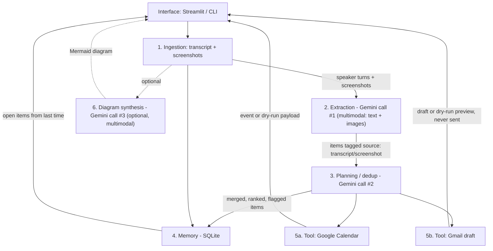

# Architecture

Full system design, diagrams, and rationale. See [../README.md](../README.md) for setup and running the app; see [../CHANGELOG.md](../CHANGELOG.md) for what changed and when.

## Diagram

Data only moves downward; extraction and planning are **two separate LLM calls** (both Gemini, forced function calling), plus an optional third diagram-synthesis call.



```
transcript .txt/.vtt/.srt/paste + screenshots .png/.jpg
        |  Ingestion
        v
 speaker-turn segments + image content blocks
        |  Extraction (Gemini function call #1, multimodal)
        v
 {task, owner, due_date_iso, priority, source_quote, confidence, source}
        |  local date resolution vs meeting date
        |  Planning (Gemini function call #2 + deterministic dedup)
        v
 merged / ranked items + missing owner/date flags
        |  Memory (meetings.db)
        v
 persist + "still open from last time"
        |  Calendar tool / Gmail draft tool (or dry-run payload/preview)
        v
 Streamlit table grouped by owner, source-tagged (🖼️/📝)
```

This maps directly onto the course's own "LLM Agent: Key Components" diagram (LLM Core → Planning & Reasoning → Memory → Tools → Environment/Actions): Ingestion/screenshots = observation; Extraction = LLM Core; Planning = Planning & Reasoning; SQLite = Memory; Calendar/Gmail/diagram = Tools; event/draft creation = Agent Actions.

## Design decisions

**Why extraction and planning are separate LLM calls.** Extraction is a *faithful read*: copy tasks, owners, quotes, and spoken dates from the transcript, even if they are messy or duplicated. Planning is an *editorial pass*: merge overlapping items, flag missing owners/dates, propose defaults, and rank. Folding both into one mega-prompt makes it hard to see (or test) which mistakes are "the model misheard the meeting" vs "the model over-normalized." A second forced tool call keeps that boundary demo-able.

**Why Gemini, not Anthropic.** The original implementation used Claude; switched to Google Gemini (free tier, AI Studio) to avoid paying for API calls. The default model, `gemini-flash-lite-latest`, supports both forced function calling (needed for structured JSON extraction) and native image input (needed for screenshots) in one model — confirmed directly against the real API before adopting it. `ANTHROPIC_API_KEY` still exists in config as an optional/legacy path, but the app itself only calls Gemini.

After extraction, **relative dates are resolved in Python** against the meeting date (`by Friday`, `next week`). That logic is unit-tested and does not depend on the model.

**Low-confidence extractions.** Items with `confidence` below `LOW_CONFIDENCE_THRESHOLD` (default `0.6`) are marked `needs_review`. Missing owner or due date also forces review. The UI still shows them (with proposed defaults: optional default owner, due date = meeting date + 7 days) but they are visually flagged. Dry-run calendar push can still emit a payload using the proposed due date; a careful demo should not live-push low-confidence rows.

**Multimodal extraction (screenshots).** Screenshots (slides, whiteboards, Kanban boards) are sent as real image content blocks alongside the transcript text in the *same* Gemini call — genuine multimodal usage, not OCR bolted on. Each extracted item is tagged `source: "transcript" | "screenshot"`, which survives the planning/dedup pass (cross-checked against the locally-tracked value rather than blindly trusted from the LLM) and SQLite persistence.

**Diagram synthesis is optional and off by default.** It's a third LLM call, and not every meeting has anything diagram-worthy — the model is instructed to say so (`has_diagram: false`) rather than invent structure, same discipline as action-item extraction.

**Every external-write tool has a dry-run mode.** Calendar and Gmail both default to dry-run, printing the exact API payload/MIME preview instead of executing. Gmail is additionally *structurally* draft-only — the module only ever calls `drafts().create`, never `send`.

## Known failure cases

- **Very long transcripts.** The model context window is finite. Extremely long recordings may truncate or miss items in the middle. Chunking by time range would be the next engineering step; it is not implemented.
- **Speaker names not in the transcript.** Ingestion labels those turns `Unknown`. Extraction then often leaves `owner` null. Planning can propose a default owner but will not invent a person from silence — sample `02_design_review.vtt` is written to show this.
- **Multiple due dates for one task.** If someone says "draft by Friday, final by the 28th," extraction may emit one item or two. Planning may merge them and keep a single date. The source quote is the audit trail; the tool does not model multi-milestone tasks.
- **Ambiguous "next Friday."** Python resolves `Friday` to the coming Friday (including today if the meeting is Friday) and `next Friday` to the Friday after that. Humans do not all mean the same thing.
- **Duplicate-across-meetings recall** matches on owner and rough task similarity. Paraphrases that share few tokens may not light up "still open from last time," even though the sidebar still lists all open rows for every owner.
- **LLM non-determinism.** The same transcript can yield slightly different wording or confidence on a second run. Schema validation still requires the same keys.
- **Gemini free-tier transient errors.** `503 UNAVAILABLE` (overloaded) occurred repeatedly during development. Mitigated with retry-with-backoff (`meetingpilot/llm.py`), including a retry path for a successful-but-truncated response missing the tool call (hit once on a large multi-item planning payload). A sustained Gemini outage during a live demo would still be a hard failure — there is no fallback for the LLM layer itself, unlike Calendar/Gmail (dry-run) or `.ics` export.
- **Gemini free-tier *daily* quota (`429 RESOURCE_EXHAUSTED`) is a real demo-day risk, not just a transient error.** Both `gemini-3.5-flash` and `gemini-3.6-flash` are capped at 20 requests/day per API key (each real run costs 2+ calls: extraction, planning, optionally diagram synthesis) — hit for real during development on 2026-08-20. The existing retry logic treats 429 as retryable, which is only correct for short rate-limit bursts; for a genuinely exhausted daily quota, retrying just fails again a few seconds later for no benefit (Gemini's 429 response doesn't distinguish the two cases in a way the client currently checks). **Mitigated (2026-08-20) by switching the default model to `gemini-flash-lite-latest`** — Google doesn't publish exact free-tier RPD per model, but Flash-Lite tiers are built for high-volume use and are historically the most quota-generous free tier; a full extraction+planning+Calendar+Gmail+.ics run was re-verified live on this model with no quota error. Still worth getting a fresh API key close to demo day as a backstop, since "much higher" isn't a documented guarantee of "unlimited."
